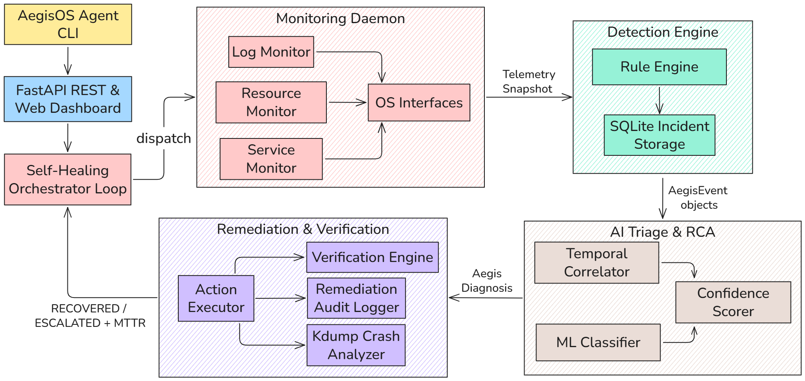
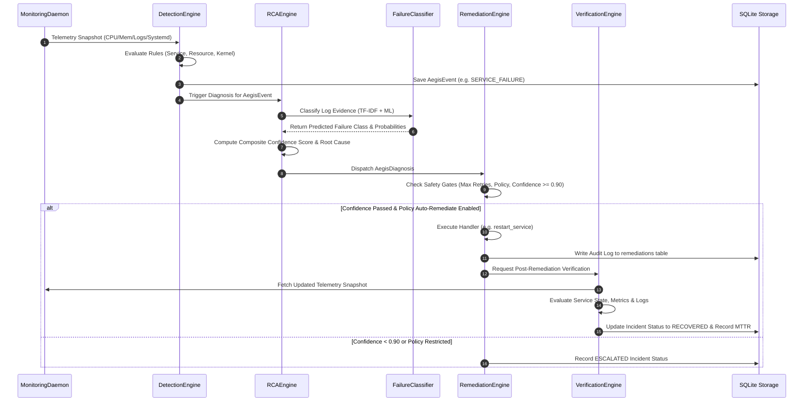

# AegisOS — System Architecture Specification

## 1. Executive Overview

**AegisOS** is an autonomous, AI-assisted self-healing Linux operating system supervisory daemon designed to continuously monitor, detect, diagnose, remediate, and verify recovery from system failures.

The architecture enforces a strict 5-stage closed feedback loop:

$$\text{Telemetry Collection} \longrightarrow \text{Failure Detection} \longrightarrow \text{AI Triage \& RCA} \longrightarrow \text{Policy-Gated Remediation} \longrightarrow \text{Recovery Verification}$$

Rather than allowing unconstrained AI model execution on system control interfaces, AegisOS uses a policy-driven, confidence-scored remediation engine with mandatory verification, multi-layer safety gates, audit logging, and fallback escalation mechanisms.

---

## 2. High-Level System Architecture

The diagram below illustrates the exact component breakdown and data flows of the AegisOS system architecture across all layers:



```
                                  ┌─────────────────────────────────────────┐
                                  │            AegisOS Agent CLI            │
                                  │               (agent.py)                │
                                  └────────────────────┬────────────────────┘
                                                       │
                                 ┌─────────────────────┴─────────────────────┐
                                 │       FastAPI REST & Web Dashboard        │
                                 │              (dashboard/api.py)           │
                                 └─────────────────────┬─────────────────────┘
                                                       │
 ┌─────────────────────────────────────────────────────┴─────────────────────────────────────────────────────┐
 │                                       Self-Healing Orchestrator Loop                                       │
 │                                           (verification/loop.py)                                          │
 └──────┬──────────────────────────────┬──────────────────────────────┬──────────────────────────────┬───────┘
        │                              │                              │                              │
        ▼                              ▼                              ▼                              ▼
┌───────────────┐              ┌───────────────┐              ┌───────────────┐              ┌───────────────┐
│  Phase 1 & 2  │              │    Phase 3    │              │  Phase 4 & 5  │              │  Phase 6 & 7  │
│  Monitoring   │──Telemetry──►│   Detection   │───AegisEvent─►│  AI Triage &  │──Diagnosis──►│  Remediation  │
│    Daemon     │  Snapshot    │    Engine     │   Objects    │  RCA Engine   │  Objects     │ & Verification│
└───────┬───────┘              └───────┬───────┘              └───────┬───────┘              └───────┬───────┘
        │                              │                              │                              │
 ┌──────┴──────┐                ┌──────┴──────┐                ┌──────┴──────┐                ┌──────┴──────┐
 │ Log Monitor │                │ Rule Engine │                │ ML Classifier│                │ Action Exec │
 │ Res Monitor │                │  (Rules)    │                │ (Scikit-Learn│                │ (User/Kernel│
 │ Svc Monitor │                │ SQLite DB   │                │ Correlator  │                │ Verification│
 └──────┬──────┘                └─────────────┘                │ Scorer      │                │ Audit Logger│
        │                                                      └─────────────┘                └───────┬───────┘
        ▼                                                                                             │
 ┌───────────────┐                                                                             ┌──────┴──────┐
 │ OS Interfaces │ (journald, dmesg, systemd, /proc, /sys)                                     │ Kdump Engine│
 └───────────────┘                                                                             └─────────────┘
```

---

## 3. Data Models & Core Schemas (`common/events.py`)

AegisOS uses strongly-typed Python dataclasses and string enumerations to ensure clean data validation across all modules.

### 3.1 Enumerations
- **`FailureType`**: `SERVICE_FAILURE`, `MEMORY_EXHAUSTION`, `CPU_OVERLOAD`, `DISK_EXHAUSTION`, `KERNEL_ERROR`, `DRIVER_FAILURE`, `CONFIGURATION_ERROR`, `UNKNOWN_FAILURE`.
- **`Severity`**: `INFO`, `WARNING`, `CRITICAL`.
- **`RiskLevel`**: `LOW`, `MEDIUM`, `HIGH`, `CRITICAL`.
- **`EvidenceKind`**: `log_line`, `metric`, `service_state`, `process`, `file_excerpt`.

### 3.2 `AegisEvent` (Normalized Incident Event)
Emitted by the detection engine upon detecting an anomaly:
```python
@dataclass
class AegisEvent:
    event_id: str                   # UUID4 unique event identifier
    timestamp: str                  # ISO 8601 UTC timestamp
    failure_type: FailureType       # Categorized failure classification
    source: str                     # Source subsystem (e.g. systemd, kernel_dmesg, resource_monitor)
    severity: Severity              # Severity level (INFO, WARNING, CRITICAL)
    raw_evidence: list[dict]        # Key-value evidence payload dictionaries
    affected_unit: str | None       # Target systemd service or mount path
    affected_process: str | None    # Faulting process name or PID
    tags: list[str]                 # Label tags (e.g. ["service", "systemd", "failed"])
```

### 3.3 `AegisDiagnosis` (RCA Output)
Produced by the Root-Cause Analysis Engine linking an incident to a diagnosis and action plan:
```python
@dataclass
class AegisDiagnosis:
    event_id: str                   # Corresponding AegisEvent ID
    failure_type: FailureType       # Standardized failure type
    probable_root_cause: str        # Human-readable synthesized root-cause string
    evidence: list[str]             # Formatted evidence bullet points
    confidence_score: float         # Composite confidence score (0.0 to 1.0)
    recommended_remediation: str    # Recommended policy action string
    risk_level: RiskLevel           # Impact risk rating
    correlated_event_ids: list[str] # Identifiers of temporally linked events
```

---

## 4. Component Deep Dive

### 4.1 Monitoring Subsystem (`monitor/`)

The monitoring layer periodically probes the host Linux environment without external daemon dependencies:

- **`MonitoringDaemon` (`monitor/daemon.py`)**: Coordinates individual monitors into a single structured telemetry snapshot:
  ```json
  {
    "timestamp": "2026-09-04T18:00:00Z",
    "system_metrics": { "cpu": {...}, "memory": {...}, "disk": {...} },
    "failed_services": [ ... ],
    "monitored_services": [ ... ],
    "top_processes": [ ... ],
    "journal_logs": [ ... ],
    "dmesg_logs": [ ... ],
    "threshold_alerts": [ ... ]
  }
  ```
- **`LogMonitor` (`monitor/log_monitor.py`)**: Uses `journalctl -o json` and `dmesg` regex filtering to extract panic traces, OOM kill events, and service exit codes.
- **`ResourceMonitor` (`monitor/resource_monitor.py`)**: Queries `/proc/meminfo`, `/proc/stat`, `/proc/diskstats`, and `psutil` for usage metrics and top CPU/Memory consumers.
- **`ServiceMonitor` (`monitor/service_monitor.py`)**: Queries DBus / `systemctl` for active, substate, and restart count tracking.

---

### 4.2 Failure Detection Engine (`detector/`)

- **`BaseDetector` & Detectors (`detector/rules.py`)**:
  1. **`ServiceDetector`**: Flags systemd units in `failed` state or exceeding `max_restarts` threshold (default: 3).
  2. **`ResourceDetector`**: Evaluates CPU, memory, and disk usage against configurable warning and critical thresholds (e.g. CPU > 90%, Memory > 95%, Disk > 95%).
  3. **`KernelDetector`**: Uses compiled regular expressions to parse `dmesg` and syslog for OOM invocations, kernel panics, segmentation faults, and driver lockups.
- **`DetectionEngine` (`detector/engine.py`)**: Runs all active detectors against a telemetry snapshot, deduplicates events, and persists them into SQLite storage.
- **`IncidentStorage` (`detector/storage.py`)**: Manages the `incidents` table in SQLite (`data/aegisos.db`) with full indexing on timestamps and failure types.

---

### 4.3 Root-Cause Analysis & AI Triage (`rca/` & `ai/`)

The RCA subsystem transforms raw alerts into actionable diagnoses:

- **`TemporalCorrelator` (`rca/correlator.py`)**: Groups events occurring within a configurable temporal correlation window (default: 300 seconds) and formats raw evidence into human-readable bullets.
- **`FailureClassifier` (`ai/classifier.py` & `ai/trainer.py`)**:
  - Implements a Machine Learning pipeline using TF-IDF feature extraction combined with a Scikit-Learn classifier (Random Forest / Logistic Regression).
  - Preprocesses log messages (`ai/preprocessor.py`), tokenizes diagnostic output, and outputs predicted failure classes with class probabilities.
- **`ConfidenceScorer` (`rca/scorer.py`)**: Calculates a multi-signal composite confidence score:

  $$\text{Score} = w_{\text{ML}} \cdot S_{\text{ML}} + w_{\text{Rule}} \cdot S_{\text{Rule}} + w_{\text{Corr}} \cdot S_{\text{Corr}} - P_{\text{Penalty}}$$

  Where:
  - $w_{\text{ML}} = 0.4$, $w_{\text{Rule}} = 0.4$, $w_{\text{Corr}} = 0.2$
  - Confidence Policy Boundaries:
    - **$< 0.70$**: Escalate to Human Operator.
    - **$0.70 - 0.90$**: Recommend Action (Manual Confirmation).
    - **$> 0.90$**: Execute Automated Remediation.
- **`RCAEngine` (`rca/engine.py`)**: Orchestrates correlator, classifier, and scorer to construct the final `AegisDiagnosis`.

---

### 4.4 Remediation & Policy Engine (`remediation/`)

The remediation subsystem executes recovery procedures while guaranteeing system safety:

- **`RemediationEngine` (`remediation/engine.py`)**: Enforces multi-stage safety controls:
  1. **Max Retry Limit Gate**: Aborts remediation if an incident exceeds `max_retries` (default: 3).
  2. **Kernel Remediation Gate**: Queries `KernelPatchDatabase` (`remediation/kernel_db.py`) for approved signatures; blocks unapproved kernel actions unless explicit admin approval is provided.
  3. **Auto-Remediate Gate**: Enforces policy flags (`config/remediation-policies.yaml`).
  4. **Confidence Gate**: Enforces threshold criteria ($ \ge 0.90 $ for autonomous execution).
- **User-Space Action Handlers (`remediation/actions.py`)**:
  - `restart_service(unit_name)`: Triggers `systemctl restart <unit>`.
  - `cleanup_temp_files(dirs)`: Safely cleans designated temporary directories (`/tmp`, `/var/tmp`).
  - `restore_configuration(target_path)`: Restores known-good configuration files from backup storage.
  - `apply_safe_sysctl(params)`: Applies bounded sysctl adjustments (e.g. `vm.swappiness=10`).
  - `escalate(reason, event_id)`: Generates an escalation alert record for manual administrator resolution.
- **Kernel-Space Action Handlers (`remediation/kernel_actions.py`)**:
  - `blacklist_module(module_name)`: Writes modprobe blacklist file `/etc/modprobe.d/aegis-blacklist.conf`.
  - `reload_driver(driver_name)`: Executes `modprobe -r` followed by `modprobe`.
  - `apply_livepatch(patch_name)`: Invokes `kpatch load <patch.ko>` for hot-patching kernel symbols.
  - `rollback_kernel_action(...)`: Undoes applied module blacklists or patches.
- **`RemediationAuditLogger` (`remediation/audit.py`)**: Logs every action, operator, target, success state, and timestamp into the SQLite `remediations` audit table.

---

### 4.5 Recovery Verification & Feedback Loop (`verification/`)

Self-healing is incomplete without post-execution validation:

- **`HealthChecker` (`verification/checker.py`)**: Evaluates post-remediation system health:
  - Verifies systemd unit active states.
  - Re-evaluates CPU, Memory, and Disk metric thresholds.
  - Scans recent logs for residual error signatures.
- **`VerificationEngine` (`verification/engine.py`)**: Determines overall recovery status (`RECOVERED` vs `ESCALATED`) and computes Mean Time to Recovery (MTTR):

  $$\text{MTTR} = T_{\text{recovery\_verified}} - T_{\text{incident\_detected}}$$

- **`MetricsTracker` (`verification/metrics.py`)**: Aggregates lifetime performance statistics:
  - Total Incidents & Total Remediations.
  - Remediation Success Rate (%).
  - System Average MTTR (seconds).
- **`SelfHealingLoop` (`verification/loop.py`)**: The primary coordinator executing the continuous 5-stage loop.

---

### 4.6 Kernel Crash Dump & Kdump Analysis (`kdump/`)

- **`CrashAnalyzer` (`kdump/analyzer.py`)**: Regex engine capable of parsing `vmcore-dmesg` text outputs and kernel panic traces to extract:
  - Panic Type & Summary Message.
  - Faulting Instruction Pointer (RIP) & Function Name.
  - Suspect Kernel Module Tag (e.g. `[my_test_driver]`).
  - Stack Call Trace lines.
- **`KdumpManager` (`kdump/manager.py`)**: Monitored path inspector checking `/var/crash` for new vmcore dumps.

---

### 4.7 REST Backend & Web Dashboard (`dashboard/` & `agent.py`)

- **FastAPI REST API (`dashboard/api.py`)**:
  - `GET /api/health`: Returns current system telemetry.
  - `GET /api/incidents`: Query recorded incident history.
  - `GET /api/remediations`: Query remediation audit logs.
  - `GET /api/metrics`: Returns system MTTR and success rate metrics.
  - `POST /api/trigger-scenario`: Injects synthetic test failure scenarios (`service_failure`, `cpu_overload`, `memory_exhaustion`, `disk_exhaustion`).
  - `POST /api/run-cycle`: Triggers an instant end-to-end self-healing cycle.
- **Single-Page Dashboard (`dashboard/static/index.html`)**: Real-time visualization dashboard displaying health gauges, incident timelines, diagnostic confidences, and remediation status.
- **Unified Agent CLI (`agent.py`)**: Command line interface providing `status`, `incidents`, `metrics`, `trigger-scenario`, `run-cycle`, `serve`, and `daemon` modes.

---

## 5. End-to-End Incident Lifecycle



---

## 6. Configuration Management Architecture (`config/`)

AegisOS behavior is driven by declarative YAML configuration files located in `config/`:

| Configuration File | Responsible Layer | Description |
| :--- | :--- | :--- |
| `config/aegisos.yaml` | Core Agent & Daemon | Main system settings, log levels, polling intervals, and SQLite DB paths. |
| `config/thresholds.yaml` | Detection Engine | Quantitative resource boundaries (CPU warning/critical %, Memory %, Disk %). |
| `config/remediation-policies.yaml` | Remediation Engine | Whitelisted actions, auto-remediate toggles, and safe parameters per failure class. |
| `config/confidence-policies.yaml` | RCA Engine | ML feature weights, policy thresholds, and maximum retry parameters. |
| `config/kernel-remediations.yaml` | Kernel Engine | Database of approved kernel patch signatures, module mappings, and admin approval requirements. |

---

## 7. Security, Safety, and Scope Boundaries

1. **Non-Destructive User-Space Remediation**: AegisOS limits default autonomous recovery actions to low-risk system administration routines (`systemctl restart`, directory cleanup, sysctl tuning).
2. **Strict Kernel Safety Gates**: Kernel hot-patching (`kpatch`) and driver blacklisting require explicit pre-approval in `kernel-remediations.yaml`. AegisOS never applies unverified AI-generated kernel code.
3. **Audit Trail Immutability**: All decisions, raw evidence, confidence scores, execution outputs, and verification results are written to SQLite audit databases (`data/aegisos.db`).
4. **Escalation Bounds**: Automatic fallback to administrator escalation occurs when retries exceed limits ($ > 3 $) or confidence falls below threshold ($ < 0.70 $).
